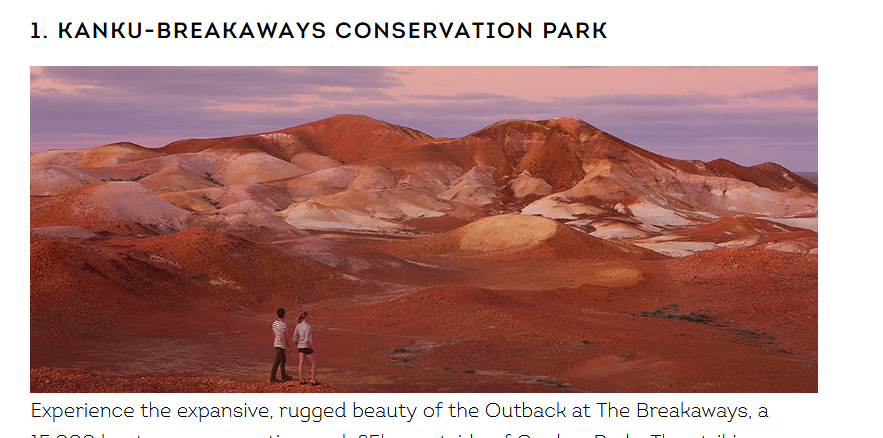
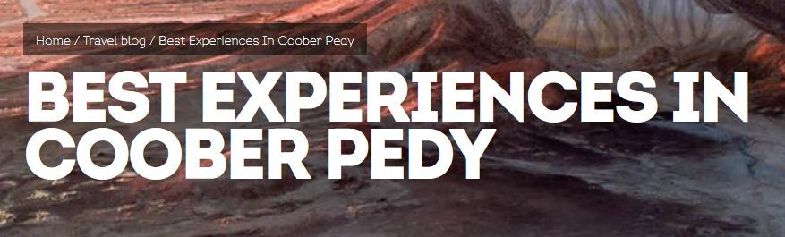
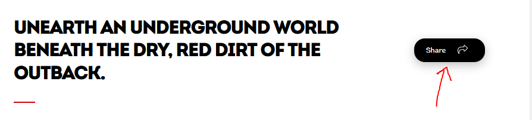
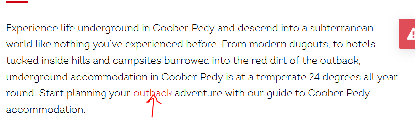
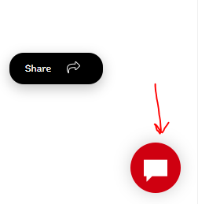
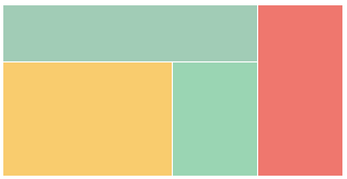

# Tute 01

## Exercise 1 - Getting to know each other

Your tutor will play an activity for everyone to get to know each other!

## Exercise 2 - CSS Basics

> 10 minutes

### Question 1

In `box.html` can you make a box that is:
 * `100px` wide
 * `50px` high
 * `3px` of padding
 * `1px` border that is solid and of colour `#333333`
 * `5px` of margin on the left and right, and `10px` of margin on the top and bottom?
 * background colour of `rgb(255,255,0)`

> See `solutions/box.html`

### Question 2

When would it be appropriate to use a CSS class definition vs id definition? 
```css
#idItem {
	color: #000;
}
.classItem {
	color: #000;
}
```

> Ids are used for elements that we only want one of the page, whereas classes are used for when we may have many elements using that name

### Question 3

Look at `eris.html`. It has a large div with a grey background. Try to:
* Include the `eris.jpg` in the background
* Toggle with the `no-repeat` property.
* Toggle the width and height of the background with respect to the outer element
* Toggle with the `position` property

> No clear direction for this. Take it as it goes.
> https://www.w3schools.com/cssref/css3_pr_background.asp

## Exercise 3 - Analysing a web page

> 15 minutes 

Take a look at this webpage. It covers a number of exciting things to do in one of Australia's most sacred places: **Coober Pedy**

https://southaustralia.com/travel-blog/best-experiences-in-coober-pedy

Use the **developer tools** capability of browsers, try and answer the following questions

### Question 1



What is the height and width of this image? What is its border, padding, and margin?

> The width of the image is 656 x 273. It has no border, padding, margin.

Can we modify any of these properties?

> Demonstrate how you can adjust any of these properties directly within dev tools, including doing things like changing the colour of the border.

### Question 2



What is the font family and font weight of the "BEST EXPERIENCES IN COOBER PEDY" text? What options exist for font family and for font weight?

> Font family is `intro` (and it's listed in the "Inherited from body" section). Font family is any valid font that the browser understands
> Font weight is 900. The larger the font weight, the more bold it is. Sometimes text descriptions (e.g. "bold", "normal") are used, however, regular numbers can be used too.

Why does the text look so cramped?

> The letter spacing is -.05em, meaning its less than the default space between characters. The line height is also 0.8 instead of the default of 1.

### Question 3



What is the border radius of this element? How big can we make the border radius? Can we make it negative?

> Border radius is `18px`. You can make it bigger, but also can't make it less than 0.

### Question 4

How is the youtube video uploaded to the page? What HTML/CSS is used there?

> Youtube videos are included via an `iframe`, which is essentially a `#include` for another webpage. In this case, it's including the URL of another youtube video. That means when this video loads its using youtube's servers and not the servers from `southaustralia.com`. You can also see that limited CSS is used.

### Question 5



What is the `:hover` state for the outback text? And what is the colour of the outback text?

> Colour is `#b6000e` and `hover` property is `text-decoration: underline`

### Question 6



How is this element floating above the page and fixed in position? What property causes that to happen?

> `.maximize { position: fixed; }`

How would we make it be fixed to the bottom of the page instead of the bottom of the window?

> `{ position: absolute; }`

### Question 7


What is the width of this red line? And where is this found in the CSS properties?

> This red line is `36px`, and is found as the `::after` property of the `heading--h2` class. This `::after` property describes an element that occurs right after the specified div.

## Exercise 4

In `flex.html` use `div` tags with `flex` properties to create a page that vaguely resembles this image:



> See `solutions/flex.html`