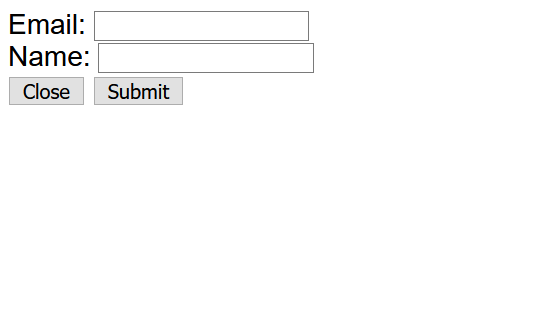

# Tute 05

## 1. Code Review

Take a look at `review.html`.
 * What is wrong with the style of the source code for this page?
 * Make appropriate changes to clean up these DOM elements.

## 2. Promises

Look at `fetchme.html`.

Why is this page not working as intended?

1. Fix the issue, so that the correct text loads
2. Handle the error case, such that if there is an issue during fetch that an appropriate error message is displayed

### Bonus Activity

Check out [randommer](https://randommer.io/api/swagger-docs/index.html) and their API docs. Get an [API key](https://randommer.io/randommer-api) so that you can fetch requests from them.

Use your knowledge of fetch and DOM manipulation to build a page that will, using a `setTimeout` render a random name to the page every 1 second.

## 3. Accessibility

Take a look at `https://mcdonalds.com.au/`. Analyse the site both in terms of:
 * Looking at the webpage as is, and in different sizes
 * The source code provided

Identify aspects of this site that could be improved with more accessible design/implementation considerations.

Use the lighthouse chrome extension to discuss other issues on the website.

## 4. Another DOM example

*This question intends to practice skills required in assignment 2.*

Build a page that has:
 * A header bar with options Home, About, News, Articles
 * A footer with a contact us link

When the items in the header bar are clicked, the "body" of the page should change to the relevant content below. NOTE: You aren't to just change the inner HTML of the body element, as there may be many nested HTML elements within that. You can either solve this via rendering all bodies and toggling which is displayed, or constantly re-rendering whichever one is being displayed currently.

When the contact us in the footer is clicked, a popup appears with standard form options for personal details. Clicking "Close" or "Submit" removes the popup and takes you back to the *same page/body you were on before*.

